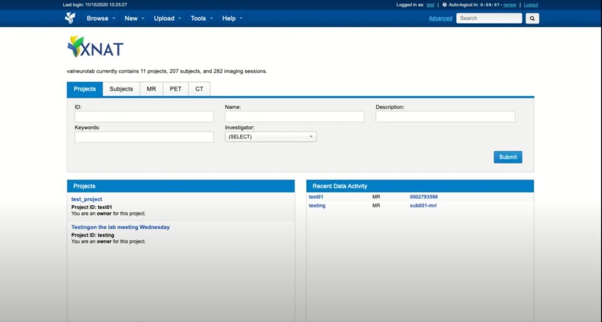
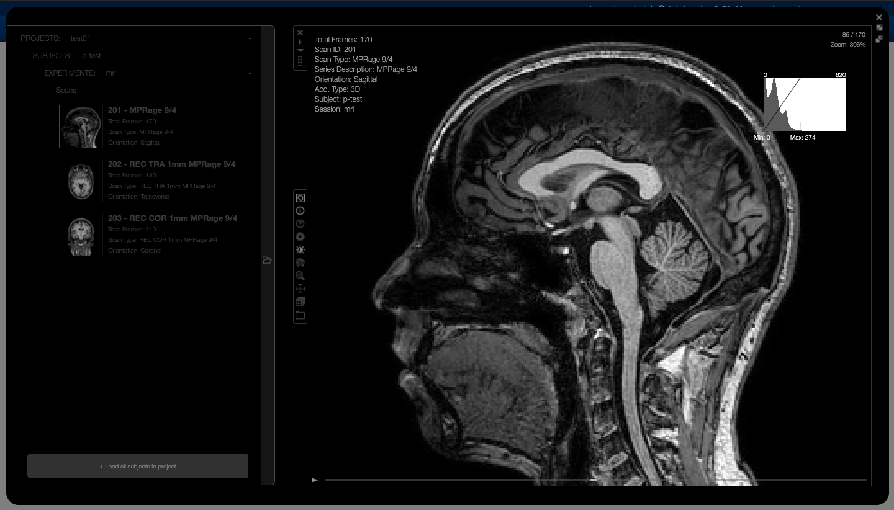

# Video Guide

Here you can find helpful video guides that walk you through the major steps of using XNAT. For videos to which access has been [privately granted](../FAQ/index.md#FAQ/VG) we suggest using the Google chrome browser.
  	

1. Click below to view the Upload of single subject data:

    

2. Click below to view a walkthrough of data levels:

    

