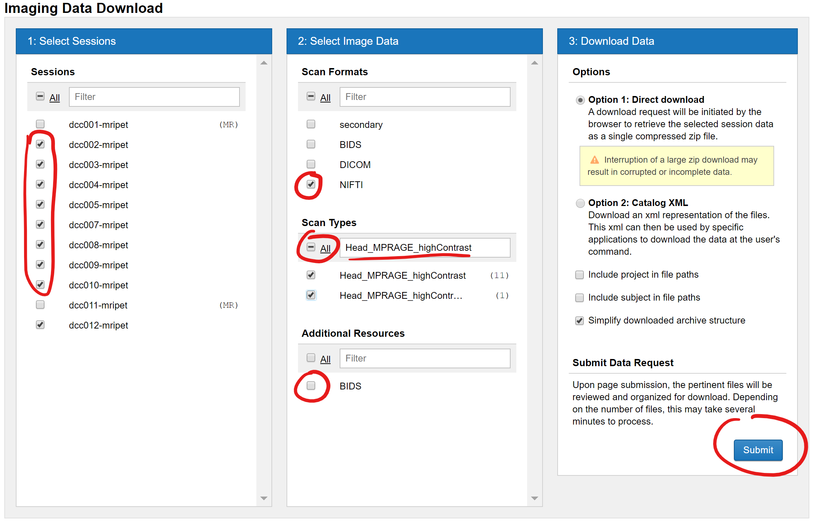
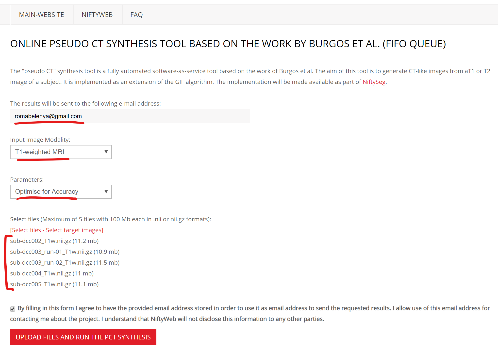

# 1.0 Create pseudo CT images

1. Download the NIFTI images for your T1 sequence
	- Go to *Project > Actions > Download images*
	- Select sessions, scan data type (NIFTI), scan type [(Fig.1)](#Cheatsheet/CT/Download)

	

	|  | 
	|:--:| 
	| **Fig.1** *Download NIFTI images.* |

	- Unzip the archive. To extract the compressed NIFTI files from the directory structure, run command from the data folder:
	`cp ./*/*/NIFTI/*.gz ./`

 

2. Upload the NIFTI files to CT synthesis tool [(Fig.2)](#Cheatsheet/CT/Synthesis)
	- Go to http://niftyweb.cs.ucl.ac.uk/program.php?p=PCT
	- Enter email, select Input Image Modality T1-weighted MRI, Parameters Optimise for accuracy
	- Select 5 files at a time
	- It takes about an hour for one file to process

	

	|  | 
	|:--:| 
	| **Fig.2** *Online CT synthesis tool.* |

 

