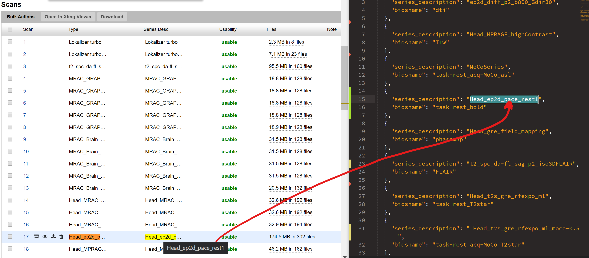
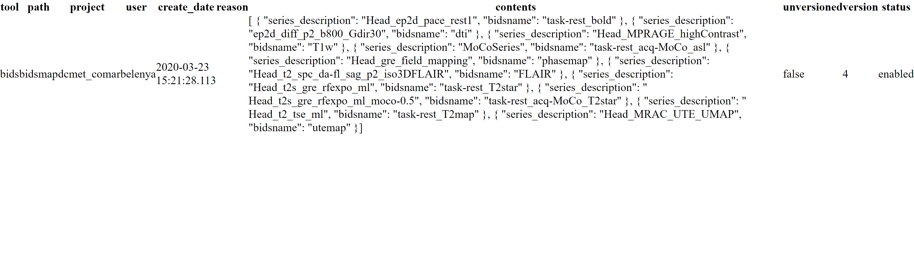
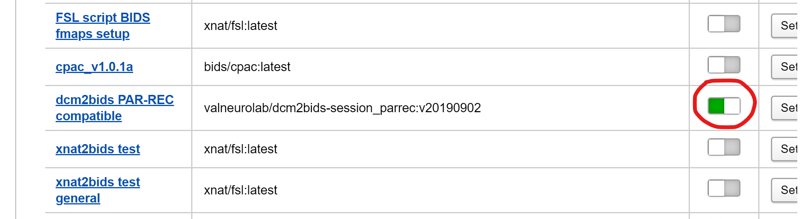
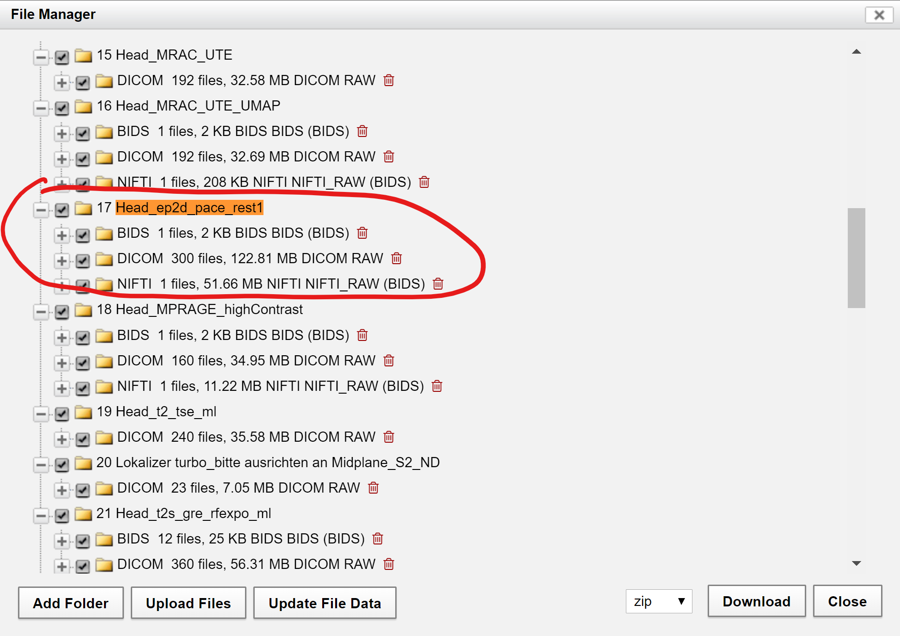

  

    Table of contents
  

  {: .text-delta }
1. TOC
{:toc}

 

***

# 3.0. Add BIDS description to series

The purpose of this step is to match series descriptions on XNAT with correct BIDS names.

### 3.1. Provide the BIDS names to series 

1. Open a json file with *'series_description': 'bidsname'* fields
	- Example: `\ [Pathname ...] \Documents\DataPipeline\bidsmap_dcmet_coma.json`
2. Open one session on xnat
	- Enter the correct series description in json file [(Fig.1)](#Manual/Add_BIDS/BIDS_description)

|  | 
|:--:| 
| **Fig.1** *BIDS series description.* |

 

### 3.2. Upload the BIDS names to XNAT

1. Use curl command to upload data in the json file with bids names to XNAT
	- On Windows: Curl is available in Windows Powershell (at least in Win10) and is an alias for *'Invoke-WebRequest'*
2. Next provide username, path to json file and project name in the link. Enter XNAT password after executing
	- It is important to put the *@ symbol* in the json file path inside the quotes
	- `curl -u <xnat_username> -p -d "@<path_to_json_file>" -k -v -X PUT`
3. After command is complete, go to the provided link to check if the file has been uploaded. It should look like [figure 2](#Manual/Add_BIDS/BIDS_2)

|  | 
|:--:| 
| **Fig.2** *Uploaded BIDS file.* |

 

### 3.3. Run Docker container
	
1. Go to *Project > Actions > Project settings*
2. Enable *'dcm2bids PAR-REC compatible'* command [(Fig.3)](#Manual/Add_BIDS/Enable_command)

	

	|  | 
	|:--:| 
	| **Fig.3** *Enabling command.* |

3. Go to a *Session > Actions > Run containers > dcm2bids PAR-REC compatible > Run container*
4. After the command is done, check that the files have appeared:
	- *Actions > File Manager*
	 Series that were entered under *series_description* in the json file should have [BIDS](../../Glossary/glossary.md/#BIDS) and [NIFTI](../../Glossary/glossary.md/#NIFTI) folders under their names [(Fig.4)](#Manual/Add_BIDS/BIDS_3)

|  | 
|:--:| 
| **Fig.4** *Uploaded BIDS format.* |

