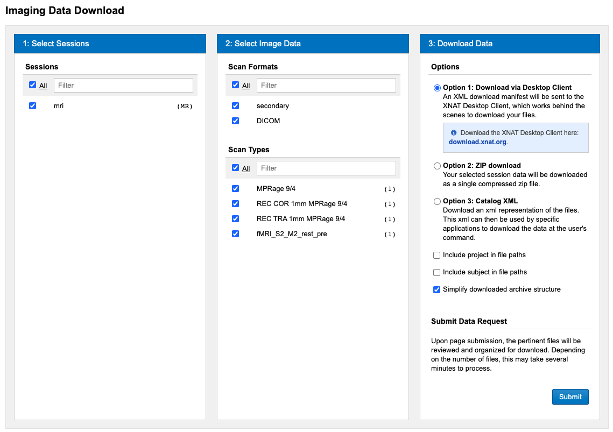
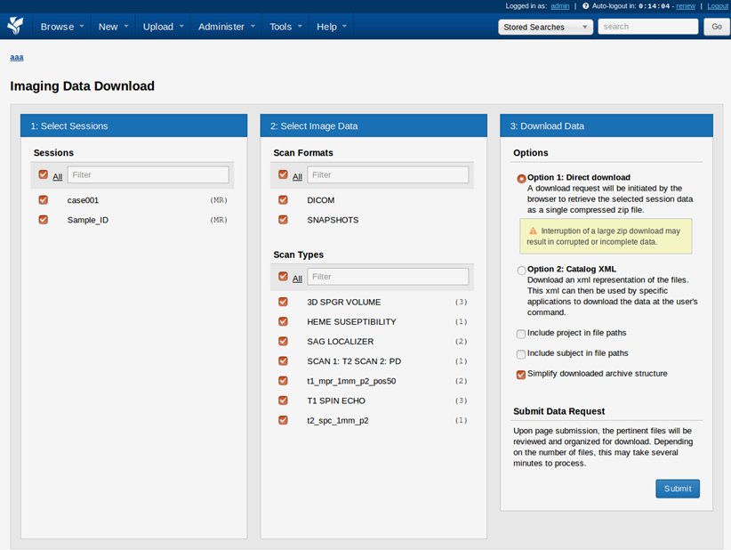
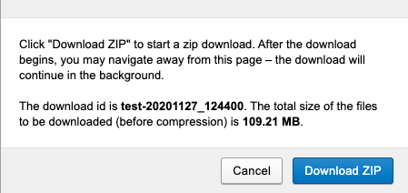

  

    Table of contents
  

  {: .text-delta }
1. TOC
{:toc}

 

# 3.0. Export

### 3.1. Export a zip file of the images from XNAT

Users can download image session data from XNAT in a variety of contexts:

1. Users can download scan files from any image session on a  **project report page** by selecting *Download Images* from the actions menu [(Fig.1)](#Manual/Download/Project_report_page)
2. Users can download scan files from an individual **session report page** by selecting *Download > Download Images* from the actions menu.
3. Users can download scan files from any *data table* containing image sessions (for example, by clicking *Browse > Data > MR Sessions* in the top navigation) by selecting *Options > Download* in the data table menu

|  | 
|:--:| 
| **Fig.1** *Project report page.* |

Using any of these mechanisms will bring the user to the download UI in the XNAT webapp. Depending on how many sessions you are downloading, or how granular you want to get concerning which scan or resource files to download, you may consider writing a download script that uses the XNAT REST API instead

**Downloading Image Sessions via the XNAT UI**

The Download Sessions UI [(Fig.2)](#Manual/Download/Download_Interface) consists of a single-screen wizard that walks you through the steps of the process.

1. Select Sessions to Download From
2. Select Scan Format and Scan Types to Download. If you find duplicated or redundant scan types in this list, you can use the Scan Type Cleanup functions in XNAT to harmonize your scan type definitions and labels
3. Select Download Format. Option 2 will download scan files to your local computer as a single compressed zip. The Catalog XML option is only used if you want to generate an XML download script for an external application to run 

|  | 
|:--:| 
| **Fig.2** *Download interface.* |

**Downloading Image Files**

After clicking *Submit*, a modal like the one above will come up and inform you of the file to be downloaded. If you wish to begin the download, simply click *Download* [(Fig.3)](#Manual/Download/Download_modal). You may then get a pop-up asking whether you want your browser to save or open the file you're downloading. After you make your selection and the file downloads, you can view the downloaded file. The file name will match the listed download ID, so 'test-20201127_124746.' is the name of the file that was saved in [(Fig.3)](#Manual/Download/Download_modal). XNAT also provides you with the total size of the files to be downloaded (before compression). If you are downloading the catalog XML, the extension will be ‘.xml'. 

|  | 
|:--:| 
| **Fig.2** *Download modal.* |

