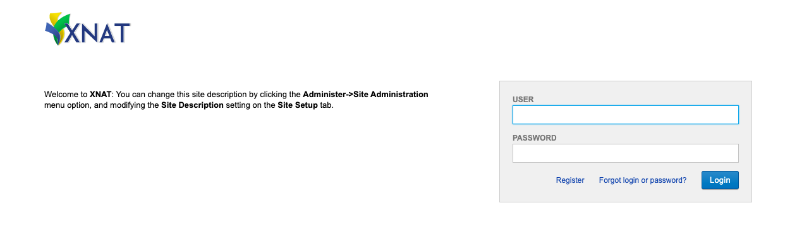

# Login and project creation

XNAT has a web interface that can be accessed by going to the [webaddress](https://central.xnat.org/app/template/Login.vm#!) from any computer with an internet connection. Once the website is loaded, log in using your user credentials. 

After you logged in, you can go to the project of interest by clicking on (i) Browse > My projects or (ii) the panel Projects in the XNAT home page. In addition, there is a panel Recent activity where you can go directly to one of the latest added (iii) subjects or directly to an specific (iv) subject’s session.