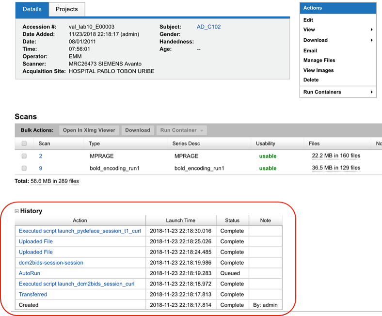
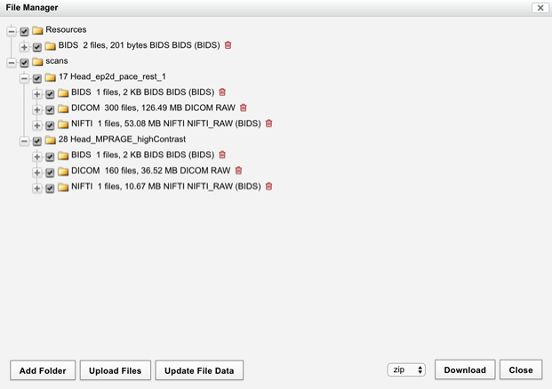

  

    Table of contents
  

  {: .text-delta }
1. TOC
{:toc}

 

***

# 5.0. Automated generation of images

Once the study/session has been added and the bidsmap json has been provided, some automatic tasks are run, e.g. creation of [NIFTI](../../Glossary/glossary.md/#NIFTI) files (dcm2nii is not run automatically and has to be run using *'run containers'*). You can check their status by checking the panel *'History'* [(Fig.1)](#Manual/NIFTIs/Panel).

|  | 
|:--:| 
| **Fig.1** *Panel history.* |

To check the uploaded and generated files (for example, NIFTI), click on Manage files in the panel *'Actions'* [(Fig.2)](#Manual/NIFTIs/File_manager)

|  | 
|:--:| 
| **Fig.1** *File manager.* |

