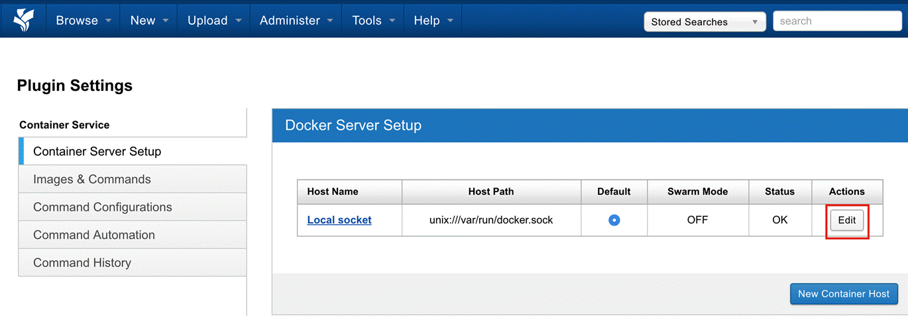
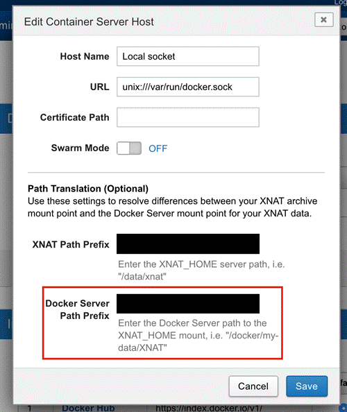
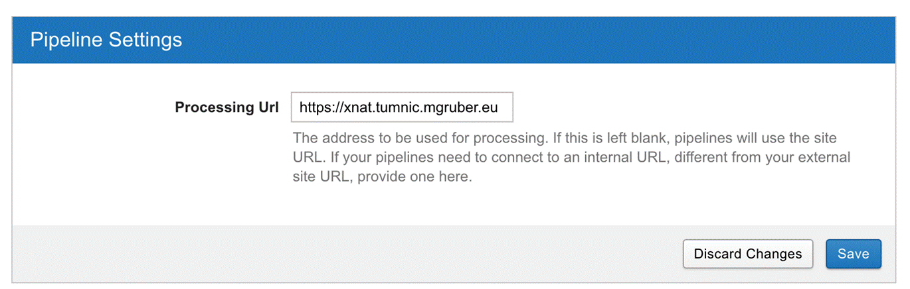
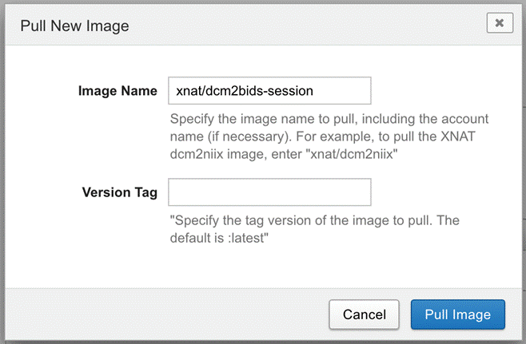

1. Go to [http://localhost](http://localhost) and login
2. Set the Path Translation by clicking on *Administer* (top bar) > *Plugin Settings*

	

	|  | 
	|:--:| 
	| **Fig.1** *Step 2.* |

3.  Edit local socket

	

	|  | 
	|:--:| 
	| **Fig.2** *Step 3.* |

4. Change the Docker Server Path Prefix to the location of the `xnat_data` directory set up in the installation page, step (2a)

	

	|  | 
	|:--:| 
	| **Fig.3** *Step 4.* |

5. Set the Processing URL (*Administer* > *Site Administration** > *Pipeline Settings** > *Processing URL*) to `http://host.docker.internal` in Mac or to the IP of the host machine in Linux

	

	|  | 
	|:--:| 
	| **Fig.4** *Step 5.* |

6. Add a docker image (*Administer* > *Plugin Settings* > *Image & Commands* > *Add New Image*), e.g. the `xnat/dcm2bids-session`

	

	|  | 
	|:--:| 
	| **Fig.5** *Step 6.* |

7. Once the image is pulled, it will appear on the *Image & Commands* tab within the *Plugin Settings* page (6)

8. If the docker image added in (6) is [XNAT Ready](https://wiki.xnat.org/pages/viewpage.action?pageId=38339164), it will have commands already added into the command, e.g. the `xnat/dcm2bids-session image`, otherwise, click on *Add new command* button. A window will appear into which you can paste or type the command JSON ([Container service Commands](https://wiki.xnat.org/display/CS/Command))

